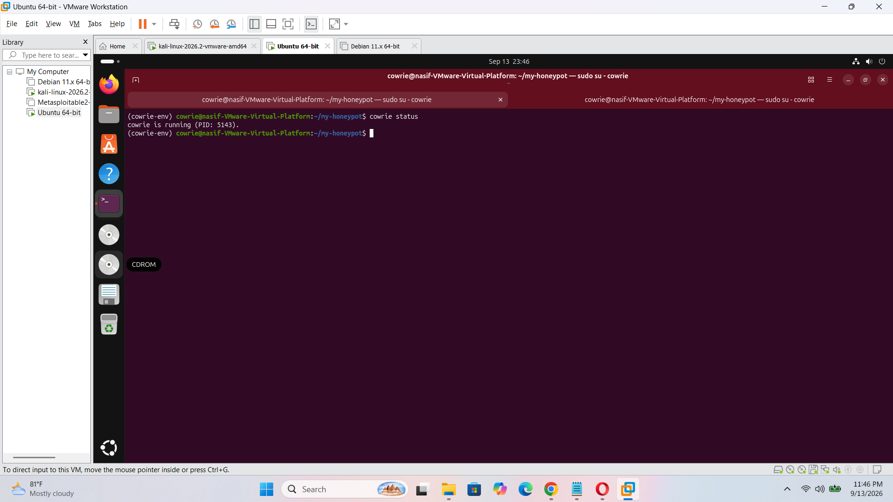
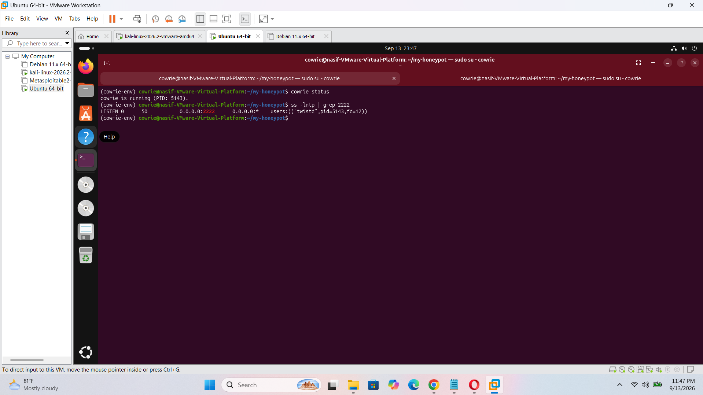
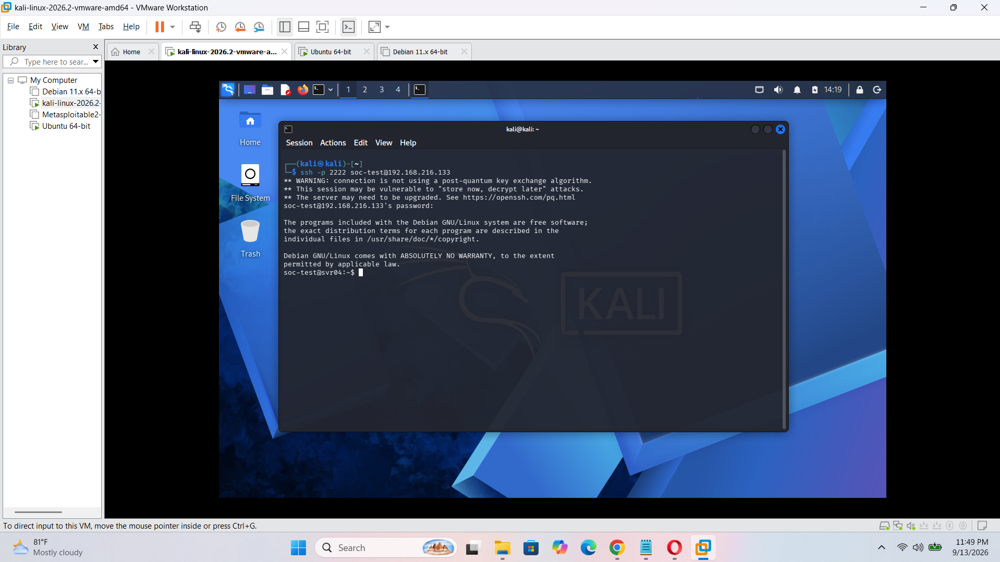
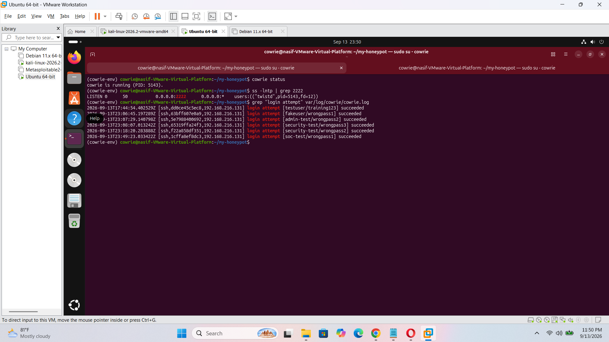
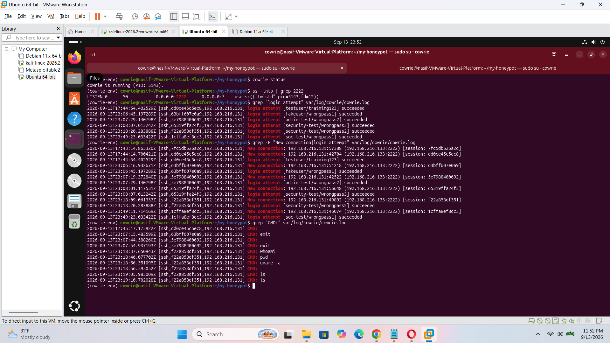

# SSH Honeypot & Attack Log Analysis Lab

## Overview

A controlled cybersecurity lab demonstrating deployment of an SSH honeypot with Cowrie in a VMware environment, generation of simulated SSH activity from Kali Linux, and analysis of authentication/session logs using a SOC-style investigation workflow.

> **Scope:** All activity was performed in an isolated VMware lab using systems controlled by the student. No public or third-party systems were targeted.

## Objectives

- Deploy and configure Cowrie as an SSH honeypot.
- Monitor SSH connection and authentication events.
- Record and review simulated shell sessions.
- Identify useful security telemetry such as source IPs, timestamps, usernames, SSH client version and HASSH fingerprint.
- Build a basic incident timeline from log evidence.

## Lab Architecture

```text
Kali Linux (test client)
IP: 192.168.216.131
        |
        | SSH to TCP/2222
        v
Ubuntu + Cowrie Honeypot
IP: 192.168.216.133
        |
        v
Cowrie logs + TTY session recordings
```

## Environment

- VMware virtual machines
- Kali Linux
- Ubuntu 26.04.1 LTS
- Cowrie 3.0.13
- Python virtual environment
- SSH

## Deployment Summary

1. Updated Ubuntu packages and installed Python/build dependencies.
2. Created a dedicated `cowrie` Linux user.
3. Created an isolated Python virtual environment.
4. Installed Cowrie 3.0.13.
5. Initialized the Cowrie configuration and log directories.
6. Started Cowrie and verified that TCP/2222 was listening.
7. Connected from Kali to the honeypot and generated controlled authentication/session activity.
8. Collected and analyzed Cowrie logs and TTY session evidence.

## Evidence Collected

- Cowrie process status and PID.
- Listening service on `0.0.0.0:2222`.
- SSH connection events from `192.168.216.131` to `192.168.216.133:2222`.
- Simulated authentication events for test accounts.
- Shell command events including `whoami`, `pwd`, `uname -a` and `ls`.
- SSH client version: `OpenSSH_10.3p1 Debian-4`.
- HASSH fingerprint observed during the lab sessions: `eeca2460550b9ded084ecf2f70a75356`.
- Cowrie TTY session recordings.

## Investigation Findings

Five SSH connections were observed from the same lab source IP. Three controlled authentication events were generated within approximately two minutes using test usernames. Cowrie recorded the sessions and command activity, providing a simple example of how a SOC analyst can correlate connection, authentication and post-authentication events.

Because Cowrie is an emulated honeypot, the recorded `succeeded` authentication results represent simulated successful honeypot sessions rather than compromise of a real operating system account.

## Detection Scenario

**Scenario:** Multiple SSH authentication events from a single source against an SSH service within a short period.

**Potential detection logic:** Alert when several SSH authentication events from the same source occur within a defined time window, then correlate the source IP with the session, SSH client fingerprint and subsequent commands.

## Recommended Defensive Controls

- Restrict SSH exposure to trusted networks.
- Use key-based authentication for legitimate administration.
- Disable or tightly control password authentication where appropriate.
- Monitor authentication logs and alert on repeated suspicious activity.
- Centralize logs for correlation and retention.
- Apply firewall rules and network segmentation.
- Review and investigate unusual post-authentication commands.

## Limitations

- The source IPs were laboratory VM addresses.
- The observed activity was deliberately generated for training.
- The project demonstrates a basic SOC investigation workflow and is not a substitute for production SIEM/SOC operations.

## Skills Demonstrated

`Linux` `SSH` `Cowrie` `VMware` `Kali Linux` `Log Analysis` `Authentication Monitoring` `Incident Investigation` `IOC Identification` `Network Security` `SOC Fundamentals`

## Portfolio Evidence to Add

### Cowrie Honeypot Running


### SSH Honeypot Port


### SSH Connection from Kali


### Authentication Analysis


### Command Activity


## Author

Mohamed Naasif - Cyber Security undergraduate, ICBT Campus
